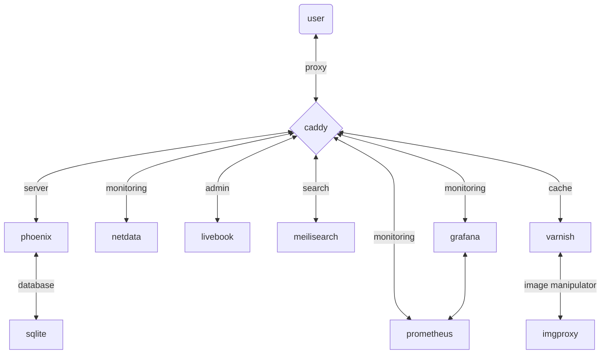

# DerpyTools

## Run Locally

1. `brew install go-task`
1. `task install:tools`
1. `task install:deps`
---
1. `task generate:caddy_cert`
1. `task setup:hosts`
---
1. `task start:imgproxy`
1. `task start:caddy`
1. `task start:server`

---

Visit [`localhost:4000`](http://localhost:4000) or [`https://derpytools.site`](https://derpytools.site)

## Architecture

#### Meta Routes

- /stats
- /version
- /health
- /release

## TODO (App)

### Blog

- [ ] Reach feature parity with Ghost Blog
  - [x] Routing
  - [x] Table of Contents
  - [x] Reading time estimation
  - [x] Human readable dates & relative time
  - [x] Footer Nav Button
  - [x] Related Posts
  - [x] Resizable Images using Imgproxy
  - [x] Routing
  - [x] HTTP/3, Brotli, AVIF like modern features achieved
  - [x] Keyboard Shortcuts
  - [ ] Proper code snippet embed
  - [ ] Code snippet copy button
  - [ ] Recent Posts
  - [ ] Blog main page
  - [ ] Tags page
  - [ ] Metadata
    - [ ] LD Json
    - [ ] Atom feed
    - [ ] Sitemap
  - [ ] Componetize all blog post elements
  - [ ] URL auto-embed, with auto image extraction
  - [ ] File uploader with cropping & compression
  - [ ] Lqip
  - [ ] Meilisearch for Command Palette
  ---
- [ ] Move blog posts
  - [ ] Taskfile
  - [ ] Multipass
  - [x] Image Compression
  ---
- [ ] Move misc pages from Ghost Blog
  - [ ] Privacy Policy
  - [ ] Terms & Conditions
  - [ ] About
  - [ ] Social Share
  - [ ] Cookie Consent
  - [ ] Contact Form

### Tools

- [ ] URL Beaver
  - [ ] Metadata Analyzer (WIP)
  - [ ] UTM Builder (WIP)
  - [ ] URL Shortener
  - [ ] Referral link manager
  - [ ] Wordle

### Authentication & Authorization

- [ ] Authentication
  - [x] Basic Auth
  - [ ] Google OAuth
  - [ ] GitHub OAuth
  - [x] Designed Auth pages to look fabulous

- [ ] Authorization
  - [ ] Add policies to restrict apps and routes to certain users
  - [ ] Add super user through an env variable

### Misc

- [x] Heartbeat
- [x] Offline Indicator
- [x] Dark Mode
- [x] Content Security Policy
- [x] Permissions Policy
- [x] Source Code Inspect
- [x] Image lazy loading
- [x] Tailwind Custom Config
- [x] CSP Nonce added to Live Dashboard & Inline Styles/Scripts
- [x] Caddy Error Routes
- [x] Varnish cache to cache Images
- [x] Added meta routes
- [x] Moved to Bandit server
- [x] Env variables split into multiple files
- [x] 404 & 500 Pages added
- [ ] UUID7
- [ ] Local storage to persist user inputs
- [ ] Build Server Side Analytics using Clickhouse

## TODO (Local)

- [ ] Litestream backup download to get a copy of production db for local testing
- [ ] Setup live book & live documentation/playground

## TODO (Stg / Prod)

- [ ] Add commands to run in staging & production
- [ ] Setup Varnish
- [ ] Setup Imgproxy
- [ ] Systemd encryption of env files
- [ ] Reduce the number of bash scripts using variables
